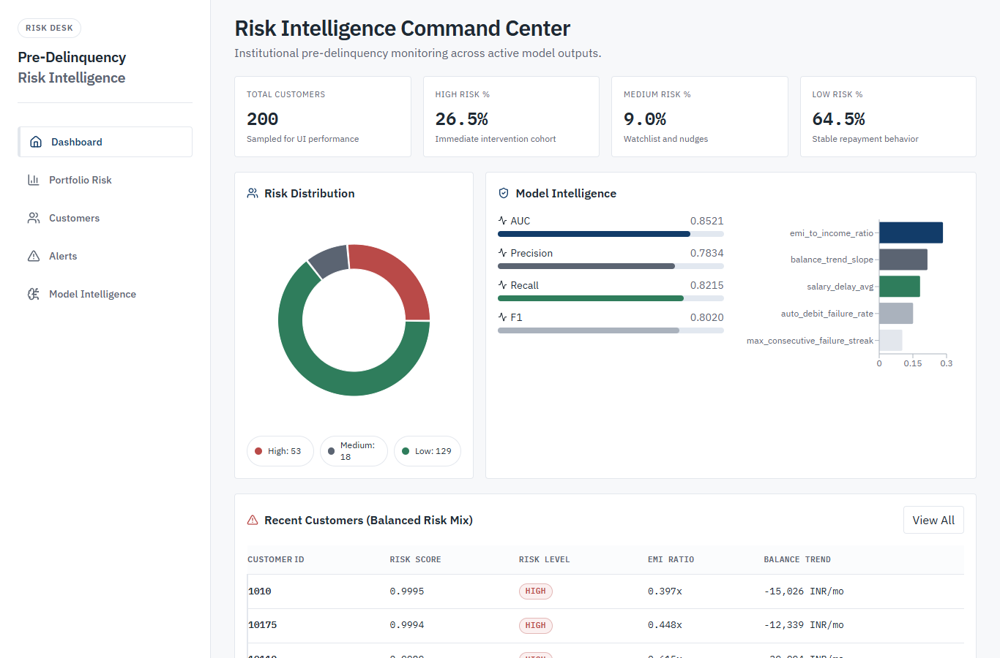

# Pre-Delinquency Risk Intelligence Platform

**An early-warning system that scores customers for repayment stress before they default, with portfolio, customer, alert and model dashboards.** Built on a simulated banking dataset (see [Data and metrics](#data-and-metrics)).

[](https://barclays-predelinquency.vercel.app)


**Live demo:** https://barclays-predelinquency.vercel.app (API on Render: `https://barclays-predelinquency.onrender.com`; the free instance can take up to a minute to wake)



## What It Does

- Predicts pre-delinquency probability from six months of customer banking behavior.
- Classifies customers into `HIGH`, `MEDIUM`, and `LOW` risk buckets.
- Serves model metrics, portfolio summaries, customer lists, explanations, and alert feeds through FastAPI.
- Presents the risk command center through a React, Vite, Tailwind, Recharts, and Framer Motion frontend.

## Tech Stack

Backend:
- Python 3.11
- FastAPI, Uvicorn, Pydantic
- pandas, numpy, scikit-learn, joblib
- Optional AWS DynamoDB/SNS hooks through `AWS_ENABLED=true`

Frontend:
- React 19
- Vite
- Tailwind CSS v4
- Recharts, ApexCharts, Framer Motion, Lucide

Data store:
- MongoDB (customer scores served by `/customers`, loaded by `scripts/ingest_to_mongodb.py`)

ML:
- Random Forest (scikit-learn), production model `ml/risk_model.pkl`
- Hold-out metrics in `ml/metrics.json`, written by `ml/evaluate_model.py` and served by `/model-metrics`

## Data and metrics

- **Data:** `data/predelinquency_risk_dataset.csv` is a simulated panel of 100,000 customers over 6 months (600,000 rows: salary, EMI, balance, salary credit day, auto-debit failures, utility delays, discretionary spend, cash withdrawals).
- **Features:** `feature_engineering.py` turns each customer's six months into 16 signals (salary trend and volatility, salary delays, EMI-to-income ratio, balance trend and volatility, auto-debit failure rate and streaks, spend trends, cash-withdrawal spikes).
- **Labels are simulated, not observed defaults.** `generate_probabilistic_target` scores each customer with a weighted mix of four engineered signals plus noise and flags the top 30% as at risk.
- **Hold-out results** (20,000 customers, `ml/metrics.json`): AUC 0.997, precision 0.905, recall 0.983, F1 0.942. Because the labels come from a rule over the same features, these scores show the model recovers that rule; they are not evidence of accuracy on real repayment data.

Rebuild the derived files (not tracked in git):

```bash
python ml/train_model.py        # rebuilds data/predelinquency_features.csv and _training_data.csv, retrains ml/risk_model.pkl
python ml/evaluate_model.py     # refreshes ml/metrics.json
```

## API Endpoints

- `GET /`
- `POST /predict`
- `POST /analyze`
- `GET /model-metrics`
- `GET /portfolio-summary`
- `GET /customers?limit=200&offset=0&mode=top_risk|random`
- `GET /customers/{customer_id}`
- `GET /customers/{customer_id}/explain`
- `GET /alerts`
- `GET /aggregator/{customer_id}`

## Local Setup

Backend:

```bash
pip install -r requirements.txt
uvicorn app.main:app --reload
```

Frontend:

```bash
cd frontend
npm install
npm run dev
```

Local URLs:
- Backend: `http://127.0.0.1:8000`
- Frontend: `http://localhost:5173`

## Render Backend Deploy

This repo includes `render.yaml`.

Use these settings if creating the service manually:
- Build command: `pip install -r requirements.txt`
- Start command: `uvicorn app.main:app --host 0.0.0.0 --port $PORT`
- Runtime: Python 3.11

Environment variables:

```text
AWS_ENABLED=false
ALLOWED_ORIGINS=https://your-vercel-app.vercel.app
```

If AWS storage/alerts are required later, set:

```text
AWS_ENABLED=true
AWS_REGION=ap-south-1
DYNAMODB_RISK_TABLE=customer_risk_scores
DYNAMODB_BEHAVIOR_TABLE=customer_behavior_profiles
SNS_TOPIC_ARN=your-topic-arn
```

## Vercel Frontend Deploy

Set the Vercel project root to `frontend`.

Environment variable:

```text
VITE_API_BASE_URL=https://your-render-service.onrender.com
```

Build settings:
- Build command: `npm run build`
- Output directory: `dist`

## Deep Learning Layer

The current RandomForest model is the best deployment choice for this repo because it is already trained, explainable, fast, and small enough for Render. A true deep learning layer should be added only after training a sequence model on the raw six-month customer panel data, then comparing it against the current baseline with holdout AUC, recall, calibration, and latency.

Recommended next step:
- Add a separate experimental `ml/train_sequence_model.py` using a small temporal MLP/LSTM.
- Persist it as a separate artifact such as `ml/sequence_risk_model.*`.
- Add an ensemble endpoint only if the sequence model beats the RandomForest on validation data and stays within deployment memory limits.

## License

MIT. See [LICENSE](LICENSE).
